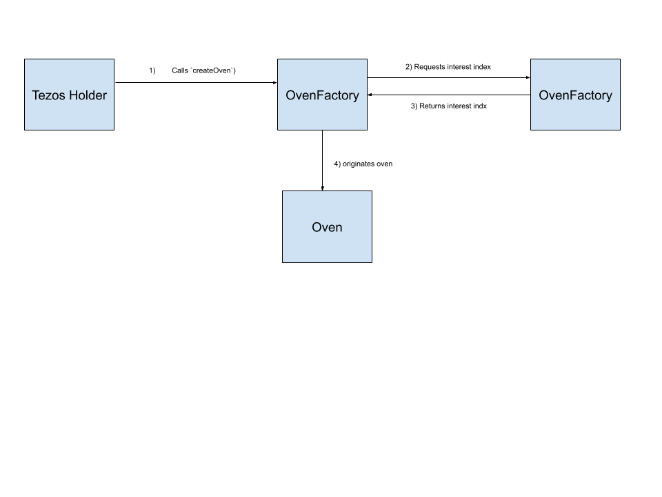
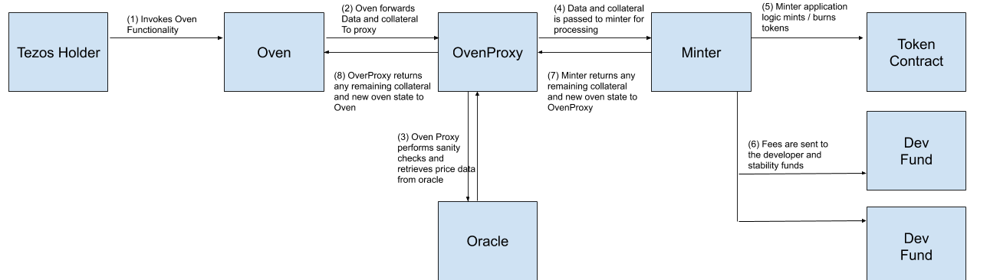

# Kolibri

Kolibri is a stable value asset built on Collateralized Debt Positions (CDPs) of XTZ. 

##  Background

All units in the Kolibri system are expressed in units of 10^-18. For instance, 123 is 0.000000000000000123.

The `token` contract is an [FA 1.2](https://gitlab.com/tzip/tzip/blob/master/proposals/tzip-7/tzip-7.md) specified with 10^-18 decimals. The symbol for the token is `KUSD`. `KUSD` is soft pegged to the USD. 

## Overview

Kolibri uses CDPs to collateralize a soft pegged stable value asset, `KUSD`. 

Each CDP has four functions:
- `Deposit`: Place `XTZ` into the CDP
- `Withdraw`: Remove `XTZ` from the CDP
- `Borrow`: Borrow `KUSD` against the CDP using XTZ as collateral
- `Repay`: Repay `KUSD` that was borrowed against the CDP. 

### Stability Fee

A stability fee is applied to borrowed `KUSD`. It is accrued in terms of `KUSD`. It is percentage based fee applied to all outstanding `KUSD` (borrowed `KUSD` + stability fee)). Interest is assesses every minute (about every block on the Tezos chain). The stability fee is adjusted via governance to increase or decrease the incentives to borrow or repay `KUSD` if the asset loses a peg.

Negative stability fees are not supported in Kolibri but may be added via a contract upgrade.

### Collateralization Ratio

In order to remain solvent, a CDP must maintain a minimum **collateralization ratio**. The collateralization ratio is computed as:
```
Collateralization Ratio = ((XTZ in CDP * Price of XTZ/USD) / (Borrowed KUSD + Stability Fees)) * 100 
```

If a CDP drops below the **collateralization ratio**, then it is said to be **under collateralized**. CDP owners should take care to keep their position above the collateralization ratio, by either locking more `XTZ` or repaying `KUSD` when the collateralization ratio drops. 

The Kolibri system will prevent users from borrowing `KUSD` such that a CDP becomes under collateralized, or withdrawing `XTZ` to cause the CDP to become undercollateralized. However, the price of `XTZ` still fluctuates, which means CDP can become undercollateralized without user action.  

### Liquidation

If a CDP becomes under collateralized, then anyone can liquidate the CDP. This user is the **liquidator**. 

In liquidation, the following happens:
1) The liquidator receives all `XTZ` in the CDP.
2) The liquidator repays all outstanding `KUSD` tokens, plus an additional percentage based **liquidation** fee assessed on the assets.
3) The CDP is marked as **liquidated** and no longer accepts deposits, withdrawals, borrows or repayments. 

This is economically beneficial to the liquidator. Meanwhile, the CDP owner is penalized heavily for letting their CDP become undercollateralized. 

The following example illustrates the benefits:
- The price of `XTZ/USD` is $2.00
- The collateralization ratio is 200%
- The liquidation fee is 10%.
- Alice opens a CDP and deposits 10 `XTZ` ($20). She borrows 10 `KUSD` ($10) against the CDP. The CDP is collateralized at 200%.
- The price of `XTZ/USD` becomes $1.50. The 10 `XTZ` is now worth $15, the 10 `KUSD `is still worth $10, and the CDP is collateralized at 150%.
- Bob notices the CDP is under collateralized and liquidates it. 
- Bob pays all outstanding `KUSD`, along with a 10% penalty, ($10 + $1 = $11) and receives $15 worth of `XTZ`

As long as the price of the outstanding `XTZ` is greater than the borrowed `KUSD` it is always economically beneficial to liquidate an undercollateralized CDP. 

### Developer and Stability Funds

Accrued stability and liquidation fees are deposited in two funds. The split is determined by the **developer fund split**. 

The role of the **stability fund** is to be a liquidator of last resort. If the price of the outstanding `KUSD` is greater than the `XTZ` locked in the CDPs then a rational economic actor would not liquidate and the CDP is **under water**. This event should not occur since it is unlikely that CDP values would go from undercollateralized to underwater fast enough that rational actors would not liquidate. However, in a black swan event, the **stability fund** acts as a public good and can liquidated underwater CDPs to restore collateralization to the system. 

The **developer fund** is a discretionary fund used to fund future developments to Kolibri. Distributions are determined via governance. 

### Precision

Internally, all values in Kolibri are represented as integers with precision of 10^-18. That is to say, the number 1.23 would be represented as
1_230_000_000_000_000_000 in Kolibri. 

Kolibri ignores precision greater than 10^-18 as the amount is believed to be neglibible.

### Compound Interest Calculations

Kolibri maintains a constant, called `stabilityFee` which caluclates interest. The stability fee is a fixed interest amount, calculated on a 60 second basis. GUIs should choose to display this interest amount in as an APY. 

Rather than calculate comound interest, Kolibri uses a linear approximation to calculate interest. That is to say that if two time periods have elapsed
then the interest calculation will be: 
```
newInterest = oldInterest * (1 + (numPeriods * stabilityFee))
```

Kolibri compounds interest for every call to the system. Given high enough usage, the system will be called at least every 60 seconds, which means interest will comound as expected. In periods of low usage, the interest will be linearly approximated, which is believed to be negligible in a system which represents numbers as small as 10^18.

### Interest Calculations on `Oven`s

Calculating interest on `n` ovens represents an unbounded computational problem, which is not feasible in a system like Tezos where you pay per unit of computation. To solve this, Kolibri introduces the idea of an `Interest Index`. 

The `Minter` contains a `Global Interest Index`. This value is initially set to 1.
Each `Oven` contains its own `Interest Index`. This value is set to the value of the `Global Interest Index` at origination time for the `Oven`.

Whenever the `Minter` is invoked, it compounds the `Global Interest Index`, using the elapsed time, stability fee, and linear approximation technique described above. 

When an `Oven` is originated, the `Minter` calculates the current `Global Interest Index` and gives it to the `Oven`. Whenever an `Oven` interacts with the `Minter`, the following process occurs:
- `Minter` recalculates `Global Interest Index`
- A ratio is calculated between the `Global Interest Index` and the `Oven`'s `Interest Index` to determine the interest the `Oven` has accured
- The `Oven`'s `Interest Index` is updated to be the same as the `Global Interest Index`


#### Bakers

The only contract in Kolibri which holds XTZ is the CDP contract. CDPs are controlled by a user and can set their own baker of their choosing. This prevents centralization and enables CDP owners to make individual and rational economic decisions for the protocol. 

### Components

#### Ovens / CDP

An `oven` rerpresents a CDP. The related contracts are:

- `Oven`s: Hold users funds, track the number of borrowed tokens, and the outstanding interest on the borrowed tokens.
- `OvenFactory`: A contract which can create `oven`s and register them in the system.
- `OvenRegistry`: A registry of all `ovens in the system.
- `OvenProxy`: The entry point into the system which all `oven`s are hardcoded to point to. 

#### Core Logic





The following three contracts compose core logic for Kolibri:

- `OvenProxy`: Is the first contract called by an `oven`. Validates that the `oven` is trusted, verifies the system is not paused, retrieves data from the `oracle`, and forwards all information to the `minter`.
- `Minter`: Core logic for the Kolibri. Takes inputs (balances, commands, oracle data), performs validation, mints / burns tokens, moves tokens to the stability funds, and calls back with new state.
- `Token`: Provides token functionality, including minting and burning
- `Fund`s: Provide implementations for the Developer fund and Stability Fund.
- `Oracle`: provides XTZ/USD into the system from external sources. 

#### `Oven` Immutability

`Oven`s are simple key value stores and are the only part of the system which cannot be upgraded (Upgrading an `Oven` leads to the chance of a malicious governance proposal stealing collateral). As such, `Oven`s have some unique properties:

`Oven`s track the following information:
- `owner`: the owner of the CDP
- `borrowedTokens`: The number of `KUSD` borrowed against the CDP
- `stabilityFeeTokens`: The number of `KUSD` borrowed against the CDP

1) They reject all calls for `deposit`, `withdraw`, `borrow` and `repay` which are not from their `owner`.
2) All `oven` are hardcoded to the `oven proxy`. The `OvenProxy` can be redirected to point to a new minter, or another intermediary `oven proxy` in case the core application logic is changed via governance. 
3) All `ovens` send along all collateral and information when they make calls into the core contracts. `Oven`s expect to receive a call back from the core with any returned collateral and new values for their state.

## Upgradeability

Kolibri is made of a set of contracts. Each contract is documented below:
- [Oven](oven.md)
- [OvenFactory](oven-factory.md)
- [OvenProxy](oven-proxy.md)
- [Oracle](oracle.md)
- [Minter](minter.md)
- [Fund](fund.md)
- [Oven Registry](oven-registry.md)
- [Token](token.md)

These contracts communicate with each other by keeping pointers to each other. For instance, the `Oven Proxy` Contract must communicate with the `Oracle` and `Minter` contracts. Both of these contrats are stored as `address`es in the `Oven Proxy`'s storage. Thus, to change the implementation of the `Oracle` contract, one simply needs to change an `address` in `Oven` proxies storage.

This modular system encourages flexibility, separation of concerns and upgradeability. 

## Data Flow

Tezos uses queue based message passing which makes it hard to return data between contracts. Tezos also commits transactions atomically, which means any contract can fail the transaction. 

### Principles

In general, Kolibri's data flow adheres to the following rules:
1) There should only be one end to end path through the system. 
2) Calls which branch off this flow should terminate without modifying state in any calling contracts.
2) Sometimes callbacks will be unavoidable; each flow should only have one callback outstanding at once to simplify logic.
4) Each contract maintains a whitelist of contracts that can call it.

### Data Flows

There are two main flows through the system:
1) `OvenFactory` -> `Minter` -> `OvenFactory`
2) `Oven` -> `OvenProxy` -> `Oracle`<sup>*</sup> -> `OvenProxy`<sup>\*</sup> -> `Minter` -> `OvenProxy` -> `Oven`

\* Optional calls

There are also two "auxilary" calls which are made. These "auxilary" calls do not call back:
1) `OvenProxy` always calls `OvenRegistry` to validate the caller is a known oven. `OvenRegistry` fails the call if the given oven was not trusted.
2) `Minter` sometimes calls `Token` to mint or burn tokens. 

## Oracle

Kolibri needs accurate data to function. Data is provided via the [Harbinger Price Feed](https://github.com/tacoinfra/harbinger) via the `Oracle` contract. The `Oracle` contract is replaceable and can be replaced to pull from another data source if needed.

## Governance

There are a few governance roles in Kolibri.

### Pause Guardian

Kolibri is able to pause borrowing, repaying, depositing and withdrawing of tokens via a **Pause Guardian**. The guardian can pause the system immediately. The guardian cannot restart the system without a governance proposal.

In the long term, this will be a multi-sig contract.

### Fund Administrator

**Fund administrators** are able to administer the Developer and Stability funds with immediate effect. Specifically, they can set the delegate for these contracts, and they can direct the funds to call `liquidate` on valid `Oven` contracts. Fund Administrators cannot move funds from the dev fund. 

In the long term, this will be a multi-sig contract.

### Governor

The **Governor** contract has four resposibilities in the Kolibri System:

In the medium term, this will be a time-locked multi-sig contract. In the long term, this will be a DAO.

#### Contract Upgrades

The Governor may set `address` references in contract storage. For instance, to upgrade the `Oracle` contract in the Kolibri system an individual would deploy a new contract in the correct shape. Then the Governor would call `OvenProxy`'s `setOracleContractAddress` method with the address of the new `Oracle`.

All contract pointers are governable, *EXCEPT* for the pointer from an `Oven` to the `OvenProxy`. This is because `Oven` code holds user's funds and is immutable so that governance may never confiscate funds.

Finally, the `minter` contract acts as the `administrator` of the `token` contract. `Minter` exposes an entrypoint to set the `admin` on the `token` contract in case the minter is upgraded.

#### System Parameters

The Governor may set new system parameters including the stability fee, the developer fund split, the collateralization ratio and the liquidation fee. 

#### Pause Guardiann

If the **Pause Guardian** pauses the system, the Governor contract is the only one who can restart the system. The rational is that the system can be paused quickly in case of emergency, but cannot be quickly restarted without broad consensus. 

#### Developer / Stability Fund Steward

The Governor can elect to transfer funds from the developer or stability fund. This is a general purpose mechanism which allows funds to be distributed via governance proposal, if so desired. If the `Developer Fund` or `Stability Fund` contracts were ever upgraded, the `Governor` would need to migrate funds to the new contracts as well.

## Long Term Features

Kolibri is a minimum viable product and it is expected that the contract will upgrade over time. Kolibri is bult to be fully upgradeable, but `oven` code is immutable to protect funds of users. We present two future upgrades which could potentially require changes to ovens. 

### Value Limited Ovens

When the system starts, we may hardcode `Oven`s to limit the amount of collateral they will accept. A future upgrade to `Oven` could remove this limitation. 

### Negative Interest Rates

The `minter` contract models the stability rate as a natural number. However, `oven` contracts model it as an `int`. This is so that an optional future upgrade of the `minter` contract can apply negative interest rates if so desired.

### Delegated Oven Control

Some users may with to delegate control of their `oven`. `Oven`'s maintain an `owner` `address` and invocations will fail if `deposit`, `withdraw`, `borrow` or `repay` are called by someone besides the owner. A newer version of `oven`s could be deployed to contain a list of addresses which may administer it. 
